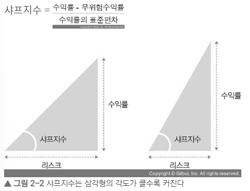
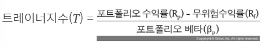
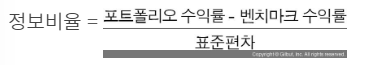
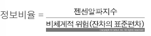
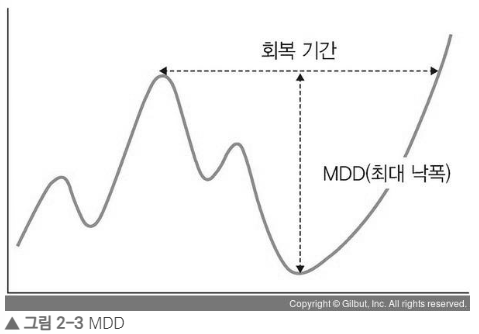

# 2장 투자와 자산배분

### 2.1 자산배분과 포트폴리오
- 자산배분은 샤프의 CAPM 모델을 사용할것, 수익률<->리스크 반비례 관계, 리밸런싱은 종목교체 뿐만아니라 자산의 내재가치를 증가, 비중조절, 종목교체를 하는과정

### 2.2 포트폴리오 성과의 결정 요인들
 - 종목선정, 마켓타이밍, 테마, 섹터만으로는 수익률을 지속하기 어렵다. 
 따라서 수익률, 리스크관리를 위해 자산배분을 해야한다

### 2.3 포트폴리오 성과 측정 삼총사
1) 샤프지수 : 투자수익률 대 변동성비율 so 클수록좋다

2) 젠센알파지수 : 포트폴리오 수익률과 기대수익률의 차이를 나타냄, 시장대비 성과 so 높을수록 좋다
젠센의 알파(α) = 포트폴리오 수익률 - 기대(적정)수익률
3) 트레이너지수 : 위험보상비율 클수록좋다

4) 정보비율 : 초과수익/리스크 

5) 최대 낙폭(MDD) : 투자기간중 고점과 저점의 최대 누적손실 

 - +a) 포트폴리오 비주얼라이저를 이용한 자산배분
 pf visualization은 pf와 투자분석을 위한 플랫폼 
 백테스팅 : 포트폴리오 자산배분을 하고 과거 데이터를 적용해 수익률이나 리스크 등이 어떻게 변하는지를 테스트해보는 것이다.
 - 요소 : time period, initial amount(시드머니), rabalancing(주기 or 조건설정), benchmark(비교대상)
 - 결과 : portfolio return(주요지표), mertics(통계자료, 위험지표), annual return(기간별, 클래스별 수익), drawdown(최대손실폭), assets