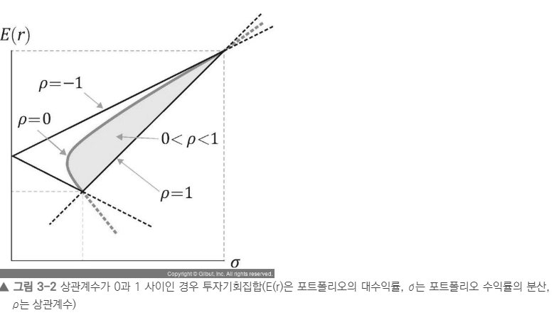
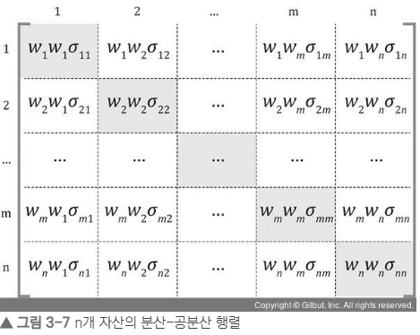
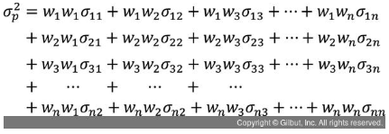

# 3장 평균-분산 포트폴리오 이론
파레토 최적리스크-수익 조합을 선택하는게 자연스럽다

## 3.1 포트폴리오의 기대수익률과 위험
<!-- not my part -->

 - 위험 줄이고 수익률 높이기위해 <상관계수가 낮은 자산 결합> 
 두 자산간 상관계수가 작을때 분산투자의 효과가 좋아진다
 여러 포트폴리오 짜놓고 수익률, 기대수익률 지배원리에 따라 최적의 pf를 결정
 ### 3.1.1 두 개 주식으로 구성된 포트폴리오
 - 기댓값 = 확률변수의 평균, 대표값이라고 볼 수 있음
 - 행렬 만드는 법
 ~~~ python
import numpy as np
np.matrix([1,2],
           [3,4])  # 2x2 matrix
 ~~~

### 3.1.2 n개 주식으로 만든 포트폴리오
 - n개의 pf 수익률, 위험 / 계산은 복잡해 numpy 사용
 ~~~ python
# numpy.random.randn 함수로 3x10 난수 행렬
import numpy as np
rnd = np.random.randn( 3, 10 )
print(rnd)

# 포트폴리오 기대수익률 계산
# 자산의 개수를 정한다. 자산의 개수는 난수를 만들 때 사용할 것이다
numStocks = 3

# 세 가지 경기 국면별로 자산의 개수만큼 주식의 수익률을 난수로 생성한다
# [3 x numStocks] 배열을 만들고 만들어진 수익률 배열을 출력한다
returns = np.random.randn( 3, numStocks )
print( '1. 난수로 만드는 국면별 주식의 수익률: \n', returns )

# 세 가지 경기 국면별 확률을 만든다. 이것 역시 난수로 만든다
# 세 가지 국면의 확률의 전체 합이 1.0이 되도록 한다
# 난수를 세 개 만든다
prob = np.random.rand( 3 )

# 생성한 난수를 난수의 합계로 나눠 합이 1.0이 되도록 한다
prob = prob / prob.sum( )
print( '2. 경기 국면별 각 확률: \n', prob )
# 경기 국면별 확률과 수익률을 행렬 곱셈한다. 연산의 결과 각 주식의 기대수익률이 계산된다
# 경기 국면별 확률과 수익률을 곱한다
expectedReturns = np.matmul( prob.T, returns )

# prob.T는 prob 전치행렬이며 두 행렬의 곱은 * 또는 matmul( ) 함수를 사용할 수 있다
expectedReturns = prob.T * returns
print( '3. 각 주식의 기대수익률: \n', expectedReturns )

# 투자 비중을 만든다. 주식의 개수(numStocks)대로 난수를 만든 후 이를 난수의 합으로 다시 나눠 전체 투자 비중의 합(100%)이 1.0이 되도록 한다
weights = np.random.rand( numStocks )
weights = weights / weights.sum( )
print( '4. 투자 비중*기대수익률: \n', weights )

# 각각의 투자 비중과 주식 기대수익률의 곱을 모두 합해 포트폴리오의 기대수익률을 계산한다
expectedReturnOfPortfolio = np.sum( weights*expectedReturns )
print( '5. 포트폴리오의 기대수익률: {:.2%}'.format( expectedReturnOfPortfolio ) )

 ~~~

 - pandas 이용해 실제데이터로 계산

 - Note : 시가총액 = 주가*주식수(기업의 가치)
          수정주가 : 액면변경, 유상증자와 무상증자로 이벤트를 주가에 반영해 주가를 수정한다 따라서 정확한 분석을 위해 종가대신 수정주가 사용해야한다

 ~~~python
 # 실제 미국 주식 데이터를 이용한 포트폴리오 기대수익률
# 필요한 라이브러리를 임포트한다
import numpy as np
import pandas as pd
from pandas_datareader import data as web
import random

# 몇 가지 종목 코드(ticker)를 갖고 포트폴리오에 포함된 주식 리스트를 만든다
tickers = [ 'MMM', 'ADBE', 'AMD', 'GOOGL', 'GOOG', 'AMZN' ]

# 수정주가를 담을 빈 데이터프레임을 미리 준비한다
adjClose = pd.DataFrame( )

# for 루프를 만들어 tickers 리스트를 반복하면서 종목 코드를 꺼내고
# DataReader 함수를 사용해 수정주가 데이터를 내려받는다
# 데이터는 야후 파이낸스를 통해 얻는다
for item in tickers:
    adjClose[ item ] = web.DataReader( item, data_source='yahoo', start='15-09-2018' )[ 'Adj Close' ]

# pandas의 pct_change 함수는 데이터의 변화량을 %로 계산한다
# 일간 수정주가 데이터를 일간수익률로 변환해 dailySimpleReturns에 저장한다
dailySimpleReturns = adjClose.pct_change( )
 
 # 기대수익률 대신 일간수익률의 평균을 계산한다 (365중 250일정도가 영업일)
# 계산 결과는 np.matrix( ) 함수를 사용해 행렬로 변환한 후 행렬 연산에 사용한다
meanReturns = np.matrix( dailySimpleReturns.mean( ) )
annualReturns = dailySimpleReturns.mean( ) * 250

# 주식의 개수만큼 투자 비중을 만든다
numAssets = len( tickers )

# 투자 비중은 난수로 만들고 투자 비중을 비중의 합으로 나눠 투자 비중의 합이 1.0이 되도록 만든다
weights = np.random.random( numAssets )
weights = weights / sum( weights )

# 투자 비중과 연간 환산수익률을 곱해 포트폴리오 기대수익률을 계산한다
# weights와 meanReturns의 차원은 1x6이다
# 행렬의 곱셈 연산을 위해 meanReturns 행렬을 전치한다(meanReturns.T)
portReturnsExpected = np.sum( weights * meanReturns.T )

 ~~~

 - 다변수가 됨 so var-cov matrix사용
 - 
 - 
 - w * matrix * w_transpose

 ~~~python
# n개 주식 포트폴리오의 분산을 계산하는 코드
# 다음 코드는 앞서 기대수익률을 계산하면서 이미 사용한 코드이므로 설명을 생략한다
import numpy as np
import pandas as pd
from pandas_datareader import data as web
import random

tickers = [ 'MMM', 'ADBE', 'AMD', 'GOOGL', 'GOOG', 'AMZN' ]
adjClose = pd.DataFrame( )

for item in tickers:
    adjClose[ item ] = web.DataReader( item, data_source='yahoo', start='15-09-2018' )[ 'Adj Close' ]
dailySimpleReturns = adjClose.pct_change( )

# 행렬 연산을 위해 weights를 matrix 데이터형으로 변환한다
weights = np.matrix( weights )

# dailySimpleReturns는 pandas의 DataFrame 객체다. 데이터형을 확인하기 위해 type( ) 함수를 사용했다
print( 'dailySimpleReturns의 데이터형: ', type( dailySimpleReturns ) )

# DataFrame 객체는 공분산을 계산해주는 cov 함수를 제공한다
# cov 함수는 DataFrame을 돌려준다. 이번에도 데이터형을 확인하기 위해 type( ) 함수를 사용했다
print( 'dailySimpleReturns.cov( ) 결과의 데이터형: ', type( dailySimpleReturns.cov( ) ) )

# cov( ) 함수로 공분산한 결과는 DataFrame이다. 이 결과는 다시 행렬 연산을 위해 변환할 것이다
# 그러므로 별도의 변수로 저장하지 않고 바로 values 함수를 사용해 행렬로 변환하고 이를 pcov 변수로 저장한다
pcov = dailySimpleReturns.cov( ).values

# 행렬 연산으로 분산을 계산한다. 즉, [비중 * 공분산 행렬 * 비중의 전치행렬]의 연산을 수행해 포트폴리오의 분산을 varp 변수에 저장하고 출력한다
varp = weights*pcov*weights.T
print( '포트폴리오 분산은 ', varp )

 ~~~

 ## 3.2 최소분산포트폴리오
  - 분산 = 위험성 so 분산은 낮을수록 좋음
  - 두자산이 같이 움직인다 = 상관계수가 높다 = 분산투자의 효과가 떨어진다
  - Note 공매도 : 하락이 예상되는 주식을 빌려서 매도하고 하락하면 매도한만큼 사서 되갚는다  즉 10원짜리가 5원이 될거같으면 10원일때 10주 팔아서 100원 벌고 50(5*10)원어치 사서 되갚는 방법

  ## 3.3 체계적 위험과 비체계적 위험
   - 체계적위험 : 분산투자로 제거할수 없는 위험(시장위험) / 경제변수(이자율, 환율, 실업률, 정책 등)
   - 비체계적위험 : 분산투자로 제거할수있는 위험 / 어닝쇼크, 소송, 노사대립 등 
   - 체계적 위험은 개별종목의 변동으로 측정 / 전체변화율과 개별종목변화율간 회귀분석으로 측정가능

   ## 3.4 무위험자산과 최적 자산배분
   - 위험이 없는 자산, 이자율, 인플레에 영향x -> 불확실성x ex)정부발행채권
   ### 3.4.1 효율적 포트폴리오
    - 두개의 주식이라도 비율을 달리해 여러 포트폴리오 구성가능 / 기대수익률과 위험 지배원리를 비교해 구성한다

### 3.4.2 기대효용과 무차별곡선
     - 무차별곡선 : 위험낮추고 효용 극대화한 곡선, 이 곡선위의 pf는 동일한 효용

### 3.4.3 최적 포트폴리오 선택
     - 