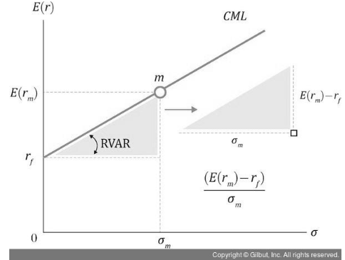
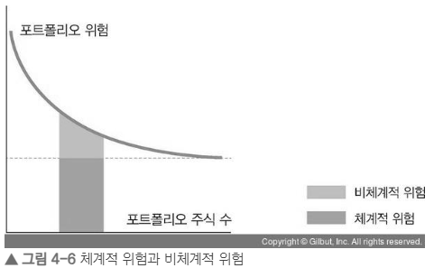

# 4장 자본자산가격결정모델 (CAPM)

## 4.1 기본 가정

4장의 내용은 **전체 시장이 균형 상태에 있음**을 기본 가정한다.  
이 상황에서 투자자들은 **리스크와 수익을 조정하며 최적의 포트폴리오**를 찾는다.  
CAPM은 평균-분산 포트폴리오 이론을 기반으로, 여기에 몇 가지 가정을 추가한 모델이다.

---

### 🔹 CAPM의 주요 가정

1. **위험회피적 투자자와 효용극대화**
   - 투자 효용을 최대화하고 싶은 **위험회피 투자자**는  
     **평균-분산 기준(mean-variance)** 으로 포트폴리오를 선택한다.

2. **완전경쟁시장**
   - 증권시장은 **완전경쟁시장**이며, **증권의 공급은 고정**되어 있다.  
   - 자본과 정보의 흐름에 **마찰 요인이 없으며**,  
     **거래비용·세금이 존재하지 않고**, **공매도 제한도 없다.**  
   - 시장정보는 모든 투자자에게 **동일하고 자유롭게 제공**된다고 가정한다.

3. **동질적 기대 (Homogeneous Expectations)**
   - 모든 투자자는 **기대수익률, 분산, 공분산에 대해 같은 기대**를 갖는다.  
   - 투자 기간이 동일하며, **미래 수익률의 확률분포를 동일하게 예측**한다.

4. **무위험자산의 존재**
   - **무위험자산(r_f)** 이 존재하며,  
     모든 투자자는 무위험이자율로 **자금을 차입하거나 대여할 수 있다.**

5. **투자대상의 한정**
   - 투자 대상은 **공개적으로 거래되는 금융자산**으로만 제한된다.

---

### ⚙️ 현실적 해석
- 이러한 가정들은 현실과는 다소 거리가 있으나,  
  **복잡한 현실을 단순화하여 강력하고 직관적인 설명**을 제공한다는 점에서 의의가 있다.

## 4.1.1 동일한 기대와 시장포트폴리오, 그리고 자본시장선
## 🔹 핵심 요약

### 1. 동일한 기대 가정 (Homogeneous Expectations)
- CAPM에서는 **모든 투자자가 동일한 기대수익률, 분산, 공분산**을 가진다고 가정한다.  
- 즉, 모든 투자자는 위험자산들에 대해 같은 정보를 바탕으로 동일한 판단을 한다.

---

### 2. 시장포트폴리오의 형성
- 이 가정 아래에서는 모든 투자자가 **같은 접점포트폴리오(효율적 포트폴리오)**를 선택하게 된다.  
- 이 포트폴리오가 곧 **시장포트폴리오(Market Portfolio)**이며,  
  구성비율은 **시장가치 비율(= 각 자산의 가격 × 수량 / 전체 시장가치)**에 따라 결정된다.

---

### 3. 시장균형
- 시장포트폴리오가 시장가치 비율대로 구성되어야 균형이 유지된다.  
- 그렇지 않으면 초과수요나 초과공급이 발생하여 가격이 변하게 된다.

---

### 4. 자본시장선 (CML, Capital Market Line)
- 무위험자산( \( r_f \) )과 시장포트폴리오( \( M \) )를 결합하면  
  투자자는 위험자산과 무위험자산 사이에서 최적 배분을 선택할 수 있다.  
- 이때 가능한 조합을 나타내는 직선을 **자본시장선(CML)**이라 한다.  
- CML은 효율적 투자 조합을 나타낸다.

---

### ✅ 요약 문장
> 모든 투자자가 동일한 기대를 가진다면, 시장은 균형을 이루며,  
> 모든 투자자의 효율적 포트폴리오는 시장가치 비율대로 구성된 시장포트폴리오가 된다.  
> 이 시장포트폴리오와 무위험자산의 조합이 자본시장선(CML)을 형성한다.

 - 

# 4.1.2 포트폴리오 베타

## 🔹 핵심 요약

### 1. 포트폴리오의 위험과 분산 효과
- 평균-분산 포트폴리오 이론에 따르면, **포트폴리오를 구성하면 분산 효과로 위험이 감소**한다.  
- 자산의 수가 많아질수록 **비체계적 위험(개별 종목 고유 위험)**은 줄어들지만,  
  **체계적 위험(시장 전체 위험)**은 남는다.
- 개별종목을 잘골라도 거시적인 리스크는 남아있다는 뜻으로 해석됨
 - 

---

### 2. 체계적 위험(시장위험)과 베타(β)
- **분산 불가능한 위험**, 즉 **시장 전체에 공통으로 작용하는 위험**을 **체계적 위험**이라 하며,  
  이를 **베타(β)**로 측정한다.
- CAPM에서는 **체계적 위험만이 보상의 대상**이 된다.
- **베타(β)**는 시장수익률 변화에 대한 **자산의 민감도**를 의미한다.
  - 시장수익률이 1% 변할 때, 개별 자산 수익률이 몇 % 변하는지를 나타냄.
  - 시장수익률은 일반적으로 **KOSPI200** 등 벤치마크 지수의 수익률로 대체한다.

---

### 3. 베타값의 해석
| 베타(β) 값 | 의미 |
|-------------|------|
| β = 1 | 시장과 동일한 변동성 |
| β < 1 | 시장보다 둔감하게 움직이는 자산 |
| β > 1 | 시장보다 민감하게 움직이는 자산 |

- 베타는 **종목뿐 아니라 포트폴리오 전체의 시장 노출도**를 측정하는 지표이다. 즉 시장대비 민감도로 해석해도됨

---

### 4. 포트폴리오 베타의 개념
- **포트폴리오 베타(βₚ)**는 시장변동에 대한 포트폴리오의 **상대적 가격 변동성**을 의미한다.
- βₚ가 클수록 시장수익률 변동(= 경기 변동)에 **더 민감하게 반응**한다.

> 예시  
> - βₚ = 1 → 시장과 동일한 움직임  
> - βₚ = 2 → 시장 변동의 두 배로 움직이는 포트폴리오

---

### 5. 포트폴리오 베타 계산
- 포트폴리오의 베타는 구성 종목의 **베타 가중평균**으로 계산된다.

\[
\beta_p = \sum_{i=1}^{n} w_i \beta_i
\]

- 여기서  
  \( w_i \): i번째 자산의 투자비중  
  \( \beta_i \): i번째 자산의 베타값  

---

### 6. 예시 (표 4-1)

| 종목 | 52주 베타 | 투자금액(억 원) |
|------|-------------|----------------|
| 삼성전자 | 1.38 | 5 |
| 한국전력 | 0.47 | 2 |
| 현대차 | 1.02 | 3 |

총 투자금액 = 10억 원
 - 베타가 작으면 경기방어주 베타가 크면 시장에 민감한 경기민감 종목 but 베타가 높다고 수익률이 높은건 아님
\[
\beta_p = \frac{5}{10} \times 1.38 + \frac{2}{10} \times 0.47 + \frac{3}{10} \times 1.02 = 1.055
\]

---

### ✅ 요약 문장
> 포트폴리오 베타는 시장 변동에 대한 포트폴리오의 민감도를 나타내며,  
> 구성 자산들의 베타를 투자비중으로 가중평균하여 계산한다.  
> βₚ가 1보다 크면 시장보다 민감하게, 1보다 작으면 시장보다 안정적으로 움직인다.

