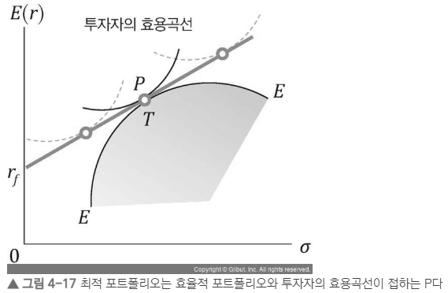
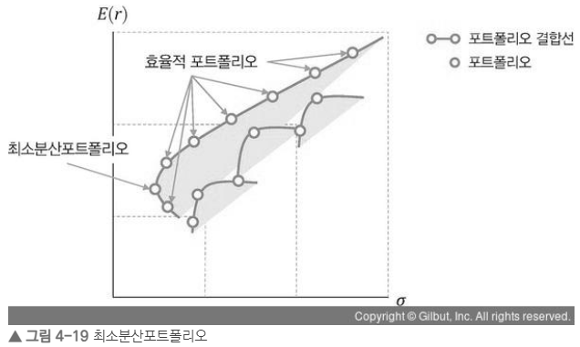

# 4.2.1 증권시장선(SML)과 자본시장선(CML)

증권시장선(SML)과 자본시장선(CML)은 모두 위험–수익 관계를 직선 형태로 나타내지만, 적용 대상과 사용하는 위험 개념이 다릅니다.

---

## 1. 자본시장선 (CML: Capital Market Line)

### 의미
- 효율적 포트폴리오(시장포트폴리오 포함)에 적용되는 선  
- 총위험(표준편차)과 기대수익률의 관계를 설명

### 기대수익률 공식
$$ E(R_p) = R_f + \frac{E(R_M) - R_f}{\sigma_M} \sigma_p $$

- \( R_f \): 무위험이자율  
- \( E(R_M) - R_f \): 시장위험프리미엄  
- \( \frac{E(R_M) - R_f}{\sigma_M} \): 샤프비율  
- \( \sigma_p \): 포트폴리오의 총위험  

---

## 2. 증권시장선 (SML: Security Market Line)

### 의미
- 모든 개별 자산과 포트폴리오의 **체계적 위험(β)** 과 기대수익률의 선형 관계 설명  
- CAPM의 핵심 결과

### 기대수익률 공식
$$ E(R_i) = R_f + \beta_i (E(R_M) - R_f) $$

- \( \beta_i \): 체계적 위험(베타)

---

## 3. SML에서의 자산 평가

### SML 위의 자산(U) → 저평가
- 동일한 β 대비 기대수익률이 더 높음  
→ 현재 가격이 낮음  
→ 매수 증가 → 기대수익률 하락 → SML로 수렴

### SML 아래의 자산(O) → 고평가
- 동일한 β 대비 기대수익률이 낮음  
→ 현재 가격이 높음  
→ 매도 증가 → 기대수익률 상승 → SML로 수렴

---

## 4. CML vs SML 비교

| 구분 | CML | SML |
|------|------|------|
| 적용 대상 | 효율적 포트폴리오 | 모든 개별 자산 및 포트폴리오 |
| 위험 지표 | 총위험(σ) | 체계적 위험(β) |
| 기울기 | 샤프비율 | 시장위험프리미엄 |
| 설명 범위 | 효율적 포트폴리오만 | 모든 자산 설명 가능 |
| 주요 활용 | 최적 투자선 | 자산 평가 기준선 |

---


# 4.2.2 위험프리미엄

시장 기대수익률과 무위험수익률의 차이를 **시장위험프리미엄**이라고 한다. 투자자는 무위험수익률에 만족할 수도 있지만, 더 높은 수익을 얻기 위해 위험자산에 투자한다. 이때 위험을 감수한 대가로 기대되는 초과수익이 바로 **위험프리미엄**이다. 일반적으로 과거 일정 기간의 시장포트폴리오 수익률과 무위험수익률의 차이를 평균하여 위험프리미엄으로 사용하며, 시장포트폴리오 대신 종합주가지수를 활용할 수도 있다.

### 시장위험프리미엄 공식
$$ \text{시장위험프리미엄} = E(R_M) - R_f $$

이 식은 단순하지만, 실제 계산에서는 다양한 논점이 존재한다. 예를 들어 수익률 산정 방식, 수익률 기간 설정, 무위험수익률의 선정 등이 분석자마다 달라질 수 있다. 현재까지 마코위츠의 평균–분산 모형처럼 널리 합의된 ‘시장위험프리미엄 계산 모델’은 존재하지 않는다.

---

## 시장위험프리미엄 추정 방법

### 1) 과거 시계열 기반(역사적 방식)
- 과거 일정 기간 동안의 시장포트폴리오 수익률과 무위험수익률의 차이를 평균하여 추정  
- 가장 널리 쓰이지만, 기간 선택과 수익률 방식에 따라 값이 크게 달라질 수 있음

### 2) 회귀분석 기반 방식
- 시장위험프리미엄을 종속변수로 두고 다른 거시경제 변수 등과 회귀모델을 구성하여 추정  
- 어떤 변수를 선택하느냐에 따라 결과 편차가 커질 수 있음

### 3) 배당성장모형(DDM) 기반 방식
1. 시장포트폴리오 대용치(예: 종합주가지수)를 사용해 **배당률**과 **배당성장률**을 추정  
2. 배당성장모형에 대입해 시장의 기대수익률을 추정  
3. 그 기대수익률에서 무위험수익률을 차감해 시장위험프리미엄 계산

---


# 4.3 포트폴리오 최적화

포트폴리오 최적화는 샤프비율과 같은 **평균–분산 효용함수**를 극대화하는 투자자산의 비중을 구하는 과정이다. 샤프비율이 가장 높은 최적 포트폴리오는 **자본시장선(CML)**과 **효율적 포트폴리오 곡선**이 만나는 접점에 위치한다.

> 최적 포트폴리오는 효율적 포트폴리오와 투자자의 효용곡선이 접하는 지점(P)이다.

최적화를 위해 필요한 요소는 다음과 같다.
- 포트폴리오의 과거 수익률  
- 자산 간 공분산  
- 파이썬 최적화 패키지 `scipy`  

직접 최적화 알고리즘을 구현할 필요는 없으며, `scipy`의 최적화 기능을 활용하면 된다.

---

## 4.3.1 최적화 패키지 scipy.optimize 알아보기

최적화 문제를 해결하기 위해서는 **scipy.optimize.minimize** 함수를 사용한다.  
이 함수는 다음과 같은 요소로 구성된다.
 - 

```python
scipy.optimize.minimize(
    fun,          # 목적함수
    x0,           # 초깃값
    args=(),      # 목적함수에 전달할 추가 매개변수
    method=None,  # 최적화 알고리즘 선택
    jac=None, hess=None, hessp=None,
    bounds=None,       # 변수의 경계값 설정
    constraints=(),    # 제약조건
    tol=None, callback=None, options=None
)
```

# 4.3.4 포트폴리오 최적화(최소분산포트폴리오 및 샤프비율)

 - 


최소분산포트폴리오(Minimum Volatility Portfolio, MVP)는 포트폴리오의 변동성이 가장 낮은 포트폴리오이다.  
3장에서 5개 종목의 종가 데이터를 이용해 무작위 비중 조합을 생성하고 효율적 경계선을 그렸다면, 이번에는 **최적화 알고리즘 SLSQP**를 사용해 최소분산포트폴리오의 투자 비중을 직접 계산해본다.

이번 최적화는 3장에서 이미 수행한 다음 내용 이후에 이어지는 코드이다.
- 주가 데이터 가져오기  
- 일간 수익률 계산  
- 공분산 행렬 계산  
- 효율적 투자선(Efficient Frontier) 시각화  

따라서 아래에서는 **최적화 부분만** 설명한다.

---

## 최소분산포트폴리오(MVP) 최적화 코드

최적화를 위해 SciPy의 `minimize` 함수를 사용한다.

```python
# 최적화 라이브러리를 임포트
from scipy.optimize import minimize

# 목적함수: 포트폴리오의 변동성(표준편차)을 최소화
def obj_variance(weights, covmat):
    return np.sqrt(weights.T @ covmat @ weights)

# 공분산 행렬을 연간 기준으로 변환
covmat = cov_daily * 250

# 초기 비중: 5개 종목을 20%씩
weights = np.array([0.2, 0.2, 0.2, 0.2, 0.2])

# 비중 제한: 각 종목 0~100%
bnds = ((0,1), (0,1), (0,1), (0,1), (0,1))

# 제약조건: 비중의 합은 100%
cons = ({'type': 'eq', 'fun': lambda x: np.sum(x) - 1})

# 최적화 실행 (SLSQP 알고리즘 사용)
res = minimize(
    obj_variance,
    weights,
    (covmat),
    method='SLSQP',
    bounds=bnds,
    constraints=cons
)

# 결과 출력
print(res)

```
# 블랙-리터만 모델

# 5. 평균-분산 모델과 블랙-리터만 모델

평균-분산 모델은 현대 포트폴리오 이론의 핵심으로, **수익을 유지하면서 위험을 줄일 수 있다는 분산투자 효율성을 수학적으로 증명한 모델**이다.  
자산 간 상관이 완전히 동일하지 않기 때문에 서로의 변동성이 상쇄되어 전체 포트폴리오의 위험이 감소하며, 이는 효율적 투자선(Efficient Frontier)에서 확인할 수 있다.

그러나 평균-분산 모델을 현실에 직접 적용할 때는 여러 한계가 존재한다.

- 기대수익률과 변동성이 **과거 자료 기반**이라는 점  
- 특정 자산에 비중이 과도하게 집중되는 **코너 해(Corner Solution)** 문제  
- 기대수익률/위험 추정 오차가 최적화 과정에서 **증폭**되어 민감하게 반응하는 문제

이러한 문제를 보완하기 위해 등장한 모델이 **블랙-리터만(Black–Litterman) 모델**이다.

---

# 5.1 블랙-리터만 모델(Black–Litterman Model)

블랙-리터만 모델은 1990년 골드만삭스의 **피셔 블랙(Fischer Black)** 과 **로버트 리터만(Robert Litterman)** 이 발표한 모델로, 전통적 평균-분산 모델의 단점을 보완하기 위해 고안되었다.

이 모델은 베이즈 정리(Bayesian Statistics)를 바탕으로 하며, 다음 두 가지 정보를 결합한다.

1. **시장 균형 상태가 암시하는 기대수익률(내재균형수익률, π)**  
2. **투자자가 제시하는 전망(Views)**  

이 둘을 결합해 새로운 기대수익률을 계산하고, 이를 평균-분산 최적화에 입력하여 최적 포트폴리오를 구성한다.

---

## 블랙-리터만 모델의 특징

- 시장 전체의 **시가총액 비중**을 활용해 자산의 균형기대수익률을 계산  
- 변동성과 비중을 활용해 기대수익률을 계산하는 점에서,  
  마코위츠 모델의 "수익률 → 비중" 방식과 정반대  
- 투자자의 전망(Views) 반영 가능  
- 극단적 비중의 코너 해결(Corner Solutions)을 완화  
- 베이즈 추론을 사용하여 "시장 균형 + 전망"을 자연스럽게 결합

---

## 블랙-리터만 계산 단계 요약

1. **시장 비중, 과거 가격 데이터, 무위험수익률 등** 필요한 시장 데이터 수집  
2. **위험회피계수(λ)** 설정  
3. **위험조정상수(τ)** 결정  
4. **균형기대수익률(π)** 계산 (역최적화 활용)  
5. **시장 전망(Views)과 결합**  
6. **결합전망기대수익률(E(r))** 도출  
7. 기대수익률을 평균-분산 모형에 입력하여 **최적 투자비중 산출**

---

## 평균-분산 모델 vs 블랙-리터만 모델 비교

| 구분 | 평균-분산 모델 | 블랙-리터만 모델 |
|------|-----------------|-------------------|
| 개요 | 자산 간 수익률·분산·상관계수를 기반으로 위험 대비 수익률 최대화 | 시장포트폴리오를 균형 포트폴리오로 보고, 투자자 전망을 추가해 최적화 |
| 수익률 | 과거 장기평균수익률 사용 | 내재수익률(역최적화) + 투자자 전망 |
| 표준편차 | 과거 장기 표준편차 사용 | 자산군 변동성 + 전망 불확실성 |
| 목적함수 | 위험조정수익률 최대화 | 조건에 따라 기대수익률 또는 위험조정수익률 최적화 |
| 장점 | 자산 분석에 유용 | 투자자 전망을 반영한 합리적 기대수익률 생성 |
| 단점 | 극단적 비중(코너해) 발생 가능 | 전망 설정에 따라 결과 변동 / 일부 시장비중 데이터 수집 어려움 |

---

## 핵심 정리

- **마코위츠(Markowitz)** : 기대수익률·분산 기반의 효율적 포트폴리오  
- **샤프(Sharpe)** : 무위험자산을 포함시켜 CAPM 완성  
- **블랙-리터만(Black–Litterman)** :  
  - 시장 균형 + 투자자 전망  
  - → 결합 기대수익률  
  - → 평균-분산 최적화 입력  
  - → 더 안정적이고 실무적 포트폴리오 비중 산출

블랙-리터만 모델은 **현대 자산배분의 표준(Standard)** 으로 자리 잡았으며, 연기금·은행·투자기관 등에서 널리 사용된다.

---


# 5.2 간단히 알아보는 베이지안 확률

베이지안 확률(Bayesian Probability)은 영국 수학자이자 목사였던 **토마스 베이즈(Thomas Bayes, 1701~1761)** 의 사상에서 비롯되었다. 생전에 수학 관련 저서는 거의 없었고, 그가 사망한 후 2년 뒤 신학자 **리처드 프라이스(Richard Price)** 가 베이즈의 논문을 왕립학회에 제출하면서 세상에 알려졌다.

---

## 빈도주의 확률 vs 베이지안 확률

일반적으로 우리가 처음 배우는 확률은 **경험적·빈도주의 확률(Frequentist Probability)** 이다.  
예를 들어 동전을 많이 던진 후 앞면이 나온 비율을 전체 횟수로 나누는 방식이 이에 해당한다.  
즉, **반복 가능한 시행**에서 사건의 장기적 비율을 확률로 정의하는 방식이다.

반면 베이지안 확률은 사건의 발생 가능성을 **미지의 불확실성(uncertainty)** 으로 본다.  
새로운 정보를 얻을 때마다 이 확률을 **업데이트**한다.

---

## 베이즈 이론(Bayes’ Theorem)

베이즈 이론의 핵심은 다음 공식 하나로 요약된다.

```md
$$ P(H \mid E) = \frac{ P(E \mid H) P(H) }{ P(E) } $$


# 5.3.2 위험회피계수(λ)

위험회피계수(λ, Risk Aversion Coefficient)는 **투자자가 위험을 얼마나 회피하는지 나타내는 계수**이며, 포트폴리오의 위험 대비 초과수익률을 수치화한 값이다.  
λ가 클수록 무위험자산 비중은 높아지고, 위험자산 비중은 낮아진다.

---

## 위험회피계수 정의

위험회피계수는 **초과수익률을 시장포트폴리오 분산으로 나눈 값**이다.

```md
$$ \lambda = \frac{ r_{BM} - r_f }{ \sigma^2_{BM} } $$
